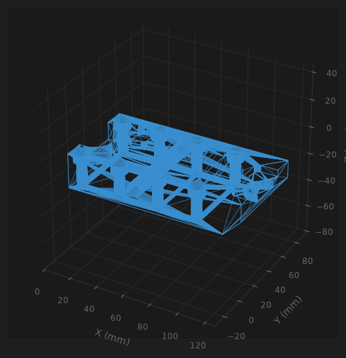
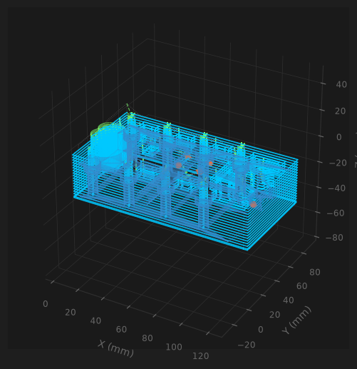

# FaoStudio — FAO 3 axes : DXF & STEP → G-code


Logiciel de FAO (Fabrication Assistée par Ordinateur) en Python : importez un
plan **DXF 2D** ou une pièce **STEP 3D**, et générez le G-code prêt pour votre
fraiseuse CNC — détection automatique des poches, perçages et contours,
sélection automatique des outils, et garde-fous physiques intégrés.

> ## ⚠️ Avertissement sécurité
> Ce logiciel pilote des machines-outils capables de causer des blessures
> graves et des dégâts matériels. **Simulez toujours le G-code généré**
> (NCViewer, CAMotics…) avant tout usinage, faites un premier passage à vide
> (pièce absente ou origine Z décalée), et gardez la main sur l'arrêt
> d'urgence. Ce logiciel est fourni **sans aucune garantie** — voir
> [LICENSE](LICENSE). Vous êtes seul responsable de son utilisation sur une
> machine réelle.

## Aperçu

| Import STEP (maillage filaire) | Trajectoires générées (pièce en filigrane) |
|---|---|
|  |  |

## Fonctionnalités

**Import & analyse**
- **DXF 2D** : lignes, arcs, cercles, polylignes, splines ; profondeurs par
  calque (convention `_Z-8` dans le nom du calque).
- **STEP 3D** (.step / .stp) : détection automatique des features —
  dimensions du brut, **silhouette réelle** de la pièce, poches à leur
  **forme exacte** (en L, avec îlots…), perçages cylindriques (ajustement par
  moindres carrés, robuste aux maillages fragmentés), avec gestion correcte
  des unités (mm / pouces / mètres).
- Filtrage physique 3 axes : les faces orientées vers le bas, enfouies sous
  la matière, ou les trous non débouchants par le dessus sont automatiquement
  écartés (lancer de rayons d'occlusion, analyse PCA de l'axe des cylindres).

**Génération G-code**
- Contournage multi-passes avec compensation du rayon d'outil (Shapely),
  entrée en rampe — jamais de plongée verticale.
- Pocketing par anneaux concentriques, îlots préservés, chaque anneau avec sa
  propre entrée en rampe.
- Perçages fraisés en **hélices G02 natives** (descente en spirale + passe de
  finition), ou cycle **G83** avec débourrage si un outil correspond
  exactement au diamètre.
- **Sélection automatique des outils** depuis le magasin : correspondance
  exacte de diamètre, sinon le plus grand outil qui passe. Chaque choix est
  tracé en commentaire dans le G-code.
- **Usinage multi-faces 3 axes** : un fichier G-code par face de la pièce
  nécessitant de l'usinage (`piece_Face_Z_PLUS.nc`, `piece_Face_X_PLUS.nc`…),
  avec instruction de retournement en tête. Les features vues depuis
  plusieurs faces ne sont usinées qu'une fois (déduplication).
- **Mode 4 axes indexé** : fichier unique, la pièce pivotée entre les faces
  par l'axe rotatif A (`G00 A90` / `A180` / `A270`).

**Sécurité — le "Bouclier"**
- Limites de la table vérifiées (X/Y), collision mandrin (longueur utile de
  l'outil vs profondeur), bridage matière pour l'acier (passe et avance
  plafonnées), diamètres d'outils invraisemblables rejetés.
- Une violation **bloque la génération** avec un message explicite — pas de
  G-code dangereux silencieux.

**Interface**
- CustomTkinter (thème sombre), visualiseur 3D Matplotlib : maillage filaire
  de la pièce, trajectoires en relief (coupes, rampes, rapides), pièce en
  filigrane sous les trajectoires après génération.
- Magasin d'outils éditable et persistant (`config.json`), console de
  diagnostic détaillée.

## Contrôleurs supportés

| Post-processeur | Machines types | Spécificités gérées |
|---|---|---|
| **ISO Standard** | Fanuc, Heidenhain, Mazak | `T{n} M06`, `M30`, `%` final |
| **GRBL** | Shapeoko, Genmitsu, OpenBuilds | changement d'outil manuel (`M00` + message opérateur), `M2` |
| **Haas / Fanuc** | armoires industrielles | `%` en 1re et dernière ligne, `O0001`, `G43 H{n}` (compensation longueur), commentaires `(MAJUSCULES)` |

## Installation

Prérequis : Python 3.10 ou plus récent.

```bash
git clone https://github.com/<votre-compte>/faostudio.git
cd faostudio
python -m venv .venv
# Windows :
.venv\Scripts\activate
# Linux / macOS :
source .venv/bin/activate
pip install -r requirements.txt
python main.py
```

## Prise en main

1. Configurez votre **magasin d'outils** (diamètre, avance, broche, longueur
   utile) et les **dimensions de votre table** dans le panneau de gauche.
2. Choisissez la **Configuration Axes** : `3 axes (Multi-Gcode par face)` ou
   `4 axes (Continu / Indexé)`.
3. **Importer STEP** (ou DXF) — la pièce s'affiche en 3D, la console liste
   les features détectées face par face.
4. **Générer G-code** — choisissez un nom de base ; en 3 axes, un fichier
   par face est écrit (`_Face_Z_PLUS.nc`, …). Les trajectoires s'affichent
   par-dessus la pièce.
5. **Simulez** chaque fichier dans NCViewer/CAMotics, réglez l'origine pièce
   sur la machine (coin inférieur gauche = X0 Y0, dessus = Z0), et usinez
   face par face en suivant les instructions de retournement.

Conventions : la pièce est automatiquement recalée (coin inférieur gauche à
l'origine, face supérieure à Z=0) ; toutes les profondeurs sont négatives.

## Limites connues

- **Fraiseuse 3 axes** (+ 4e axe indexé) : pas d'usinage 5 axes continu, pas
  de contre-dépouilles. Les perçages non verticaux sont traités par
  retournement de la pièce (multi-faces), jamais en biais.
- Les poches générales sont parcourues en segments `G01` (seuls les perçages
  circulaires utilisent des arcs `G02` natifs).
- Les fenêtres traversantes (découpes intérieures sans fond) ne sont pas
  encore générées ; l'imbrication à plus de deux niveaux (îlot dans un trou
  d'îlot) n'est pas gérée.
- Le mode 4 axes est **indexé** (3+1) : l'origine pièce est re-référencée
  sur chaque face présentée (décalages travail à gérer sur la machine). Les
  faces X± sont hors de portée d'un rotatif d'axe X (pause `M00` insérée).
- Détection STEP basée sur le maillage tessellé (via `cascadio`) : les très
  petites features (< 1 mm) peuvent passer sous les seuils de détection.

## Architecture

| Fichier | Rôle |
|---|---|
| `main.py` | point d'entrée |
| `ui.py` | interface CustomTkinter + visualiseur 3D |
| `models.py` | structures métier (outils, magasin, configuration) |
| `dxf_parser.py` | lecture DXF (ezdxf) |
| `step_parser.py` | lecture STEP, détection de features 3D (trimesh/scipy) |
| `geometry.py` | offsets et pocketing (Shapely) — aucun G-code ici |
| `gcode_generator.py` | traduction en G-code, Bouclier de Sécurité, post-processeurs |
| `tests/` | suite pytest (48 tests, dont régression sur fichier STEP réel) |

Chaque module a une responsabilité unique ; l'UI ne calcule rien, le moteur
géométrique ne connaît pas le G-code, les post-processeurs sont enfichables
(sous-classez `PostProcesseur`, enregistrez dans `_REGISTRY`).

## Tests

```bash
pip install -r requirements-dev.txt
pytest tests/
```

48 tests couvrent le moteur géométrique (offsets, îlots), le parseur STEP
(unités, fit de cercles, filtres d'occlusion — avec un fichier STEP réel en
régression) et le générateur (Bouclier de Sécurité, sélection d'outils,
arcs G02, multi-faces, les trois post-processeurs).

## Licence

Distribué sous licence **MIT** — voir [LICENSE](LICENSE). Fourni « tel
quel », sans garantie d'aucune sorte : l'utilisation du G-code généré sur une
machine réelle est entièrement sous votre responsabilité.
